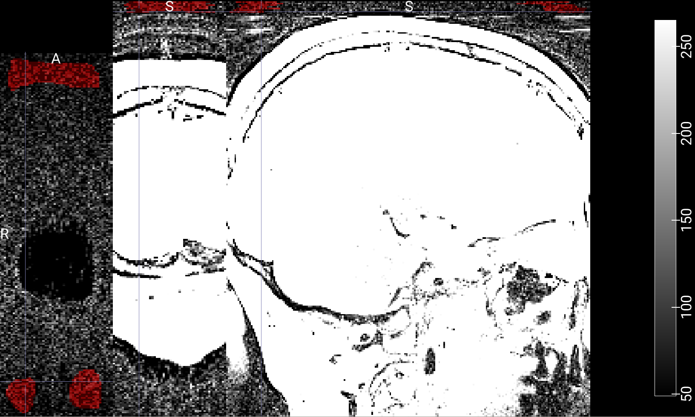

# Documentation: T2 Processing Pipeline

This page describes the T2 processing pipeline for Multi-Echo Spin-Echo (MESE) MRI data. The pipeline uses **PyMRItools (by Jochen Schmidt)** to calculate R2 and T2 maps from MESE data with B1+ field inhomogeneity correction.

> **PyMRItools** is a Python package for processing quantitative MRI data. This pipeline requires PyMRItools checked out at commit `7d29483`.<br>
> For more information on PyMRItools, please refer to the [GitHub repository](https://github.com/schmidt-jo/PyMRItools).<br>

The scripts that are described on this page are part of the **r2_processing** repository. The main processing script `t2_processing_main.sh` orchestrates the entire pipeline by submitting SLURM jobs for automated batch processing of BIDS-structured MRI data.

---

## Table of Contents

1. [Overview](#overview)
2. [Requirements](#requirements)
3. [Container Setup](#container-setup)
4. [Processing Pipeline](#processing-pipeline)
   - [Pipeline Stages](#pipeline-stages)
   - [Data Flow](#data-flow)
   - [Job Dependencies](#job-dependencies)
5. [Usage](#usage)
   - [Main Script](#main-script)
   - [Command-line Options](#command-line-options)
   - [Examples](#examples)
6. [Processing Details](#processing-details)
   - [Stage 1: Denoising and Noise Bias Correction](#stage-1-denoising-and-noise-bias-correction)
   - [Stage 2: Gradient Non-linearity Correction](#stage-2-gradient-non-linearity-correction)
   - [Stage 3: B1+ Correction and T2 Fitting](#stage-3-b1-correction-and-t2-fitting)
   - [Stage 4: Cleanup](#stage-4-cleanup)
7. [Field Strength Considerations](#field-strength-considerations)
8. [Output Structure](#output-structure)
9. [File Description](#file-description)
10. [Monitoring and Troubleshooting](#monitoring-and-troubleshooting)

---

## Overview

The T2 processing pipeline performs the following operations on Multi-Echo Spin-Echo (MESE) data:

1. **MP-PCA Denoising** - Removes noise while preserving signal using Marchenko-Pastur principal component analysis
2. **Noise Bias Correction** - Corrects for noise floor bias in magnitude images
3. **Gradient Non-linearity Correction (GNLC)** - Corrects geometric distortions from gradient field non-linearities
4. **B1+ Field Mapping** - Calculates B1+ transmit field maps from Actual Flip Angle Imaging (AFI) data
5. **Echo-Modulation Curve (EMC) Analysis** - Derives B1+ estimates from MESE signal evolution
6. **B1+ Regularization** - Combines AFI and EMC estimates for robust B1+ mapping
7. **Dictionary-based T2 Fitting** - Performs pattern matching against pre-computed signal dictionaries
8. **R2 Map Calculation** - Computes transverse relaxation rate (R2 = 1/T2) maps

The pipeline is designed for both **3T** and **7T** data, with field-strength-specific processing strategies implemented throughout. There may also be differences in processing online-reconstructed images (by the scanner) and images reconstructed from raw data offline. 

---

## Requirements

### Software Dependencies
- **Singularity/Apptainer** - For container execution
- **SLURM** - For job scheduling
- **[batch_gnlc repository](https://github.com/nkuegler/batch_gnlc/)** - with all its dependencies

The provided singularity container contains a full working environment with all necessary binaries for running the scripts in this repository (batch_gnlc repository is still needed and the GNLC step does not run inside the container yet). \
**If you are planning to avoid the container**, you need to set set up an environment containing the following software tools and packages (and adjust the code in several locations):
- **PyMRItools** - Checked out at commit `7d29483`
  - GitHub: [schmidt-jo/PyMRItools](https://github.com/schmidt-jo/PyMRItools)
- **FSL** - For image processing utilities
- **ANTs** - For image registration and resampling
- **Python 3.x** with packages (see PyMRIttools repository for more information):
  - PyTorch (with CUDA support for GPU acceleration)
  - nibabel
  - numpy
  - scipy
  - autodmri (for 7T noise masking)

### Data Requirements

- **BIDS-structured input data** with the following directory structure:
  ```
  parent_directory/
  ├── sub-XXX/
  │   ├── ses-YY/
  │   │   ├── anat/
  │   │   │   └── *_MESE.nii[.gz]  (Multi-echo spin-echo data)
  │   │   └── fmap/
  │   │       └── *_TB1AFI.nii[.gz]  (Actual flip angle imaging data)
  ```

- **Pre-computed Dictionary Databases** - Sequence-specific simulation databases for pattern matching

- **Manual Noise Masks** (required for 3T data only)
  - Binary NIfTI files containing noise-only voxels
  - Must exclude GRAPPA aliasing artifacts
  - Expected filename format: `{subject}_{session}_acq-semc_echo-01_MESE_noiseMaskManual.nii`

- **Scanner-specific spherical harmonics coefficients** - `{name}.grad` files specific to your MRI system

---

## Container Setup

The pipeline uses a Singularity container with PyMRItools and all dependencies. The prvided container is based on the viper GPU container found in [PyMRItools](https://github.com/schmidt-jo/PyMRItools/tree/niklas_loraks/apptainer) and was adjusted to meet the requirements of this repository.

> **Note:** The gradient nonlinearity correction does **not** run in the provided container yet. It therefore requires external repositories (batch_gnlc with all its dependencies) and a working installation of `FSL` and `ANTs`. If you are working on the MPI CBS compute infrastructure, the scripts will automatically use the IT-created environments/containers to make `FSL` and `ANTs` binaries available.

### Building the Container

> **Note:** If you are working in the compute infrastructure of the MPI CBS (Leipzig, Germany), the **pre-built container** may be found at: `/data/p_gr_weiskopf_software/singularity/pymritools.sif`

If that does not work for you, you have to build the container yourself. Navigate to your working directory and prepare the container build files:
> **Another hint for MPI CBS members:** It seems to be problematic to build a container directly in storage unified `/data`. Move the files to `/tmp` (on your local machine or a compute server) and build it there.

```bash
mkdir /tmp/container_build
cp pymritools_singularity.def pymritools_environment.yml /tmp/container_build
cd /tmp/container_build

# Check available space (at least 10 GB recommended)
df -h .
```

Build the Singularity container:

```bash
# With root access:
sudo singularity build pymritools.sif pymritools_singularity.def

# Without root (using fakeroot):
singularity build --fakeroot pymritools.sif pymritools_singularity.def
```

After building, move the container to your desired location:

```bash
mv pymritools.sif /path/to/your/directory
```

The container includes:
- ROCm Ubuntu 24.04 base image
- Miniforge3 (minimal Conda distribution)
- Conda environment "mri_tools_env" with all dependencies
- PyTorch with ROCm 6.2.4 GPU support
- PyMRItools (commit `7d29483`)
- Additional packages: triton, autodmri, twixtools, pypulseq
- Additional software: FSL, ANTs


---

## Using the Container

Once built, you can run commands inside the container using:
```bash
singularity exec pymritools.sif <command>
```
or open an interactive shell inside the container using:
```bash
singularity shell pymritools.sif
```

The container automatically activates the conda environment on execution.


## Processing Pipeline

### Pipeline Stages

The pipeline consists of four main stages, executed sequentially for each subject/session:

```
┌──────────────────────────────────────────────────────────────┐
│ Stage 1: Denoising & Noise Bias Correction                   │
│ - MP-PCA denoising of MESE data                              │
│ - Noise mask extraction (automatic 7T / manual 3T)           │
│ - Noise statistics calculation                               │
│ - Noise bias correction                                      │
└──────────────────────────┬───────────────────────────────────┘
                           │
                           ↓
┌──────────────────────────────────────────────────────────────┐
│ Stage 2: Gradient Non-linearity Correction (GNLC)            │
│ - GNLC for MESE data (with Jacobian modulation)              │
│ - GNLC for AFI data (with Jacobian modulation)               │
└──────────────────────────┬───────────────────────────────────┘
                           │
                           ↓
┌──────────────────────────────────────────────────────────────┐
│ Stage 3: B1+ Correction & T2 Fitting                         │
│ - B1+ mapping from AFI data                                  │
│ - EMC-based B1+ estimation from MESE                         │
│ - B1+ regularization (AFI+EMC for 7T, EMC-only for 3T)       │
│ - Dictionary-based pattern matching                          │
│ - T2 and R2 map calculation                                  │
└──────────────────────────┬───────────────────────────────────┘
                           │
                           ↓
┌──────────────────────────────────────────────────────────────┐
│ Stage 4: Cleanup (optional, default: enabled)                │
│ - Session cleanup (per-session working directories)          │
│ - Final cleanup (global working directories)                 │
└──────────────────────────────────────────────────────────────┘
```

> If the automatic noise extraction with `autodmri` fails (as with my 3T data), you have to provide manually drawn noise maps (see [here](#3T-specific-considerations))


### Data Flow

```
Input Data (BIDS)
    │
    ├── MESE echoes (anat/)
    └── AFI images (fmap/)
    │
    ↓
Denoising Output (working_dir/denoise/)
    │
    ├── *_proc-denoisedNbc_MESE.nii
    └── *_TB1AFI.nii
    │
    ↓
GNLC Output (working_dir/gnlc/)
    │
    ├── *_desc-undistortedJac_MESE.nii
    └── *_desc-undistortedJac_TB1AFI.nii
    │
    ↓
T2 Fitting Output (working_dir/t2fit/ → output_dir/)
    │
    ├── R2map.nii + .json
    ├── T2map.nii + .json
    └── TB1map.nii + .json
```

### Data Discovery and Sanity Checks

Before submitting the jobs for processing each session, the main script (`t2_processing_main.sh`) performs several validation checks:

1. **MESE File Detection**
   - Searches for files matching the pattern `*mese*` in the `anat/` directory (case-insensitive comparison)
   - Requirement: At least one MESE file must be present. Otherwise the session is skipped.

2. **TB1AFI File Detection**
   - Searches for files matching the pattern `*tb1afi*` in the corresponding `fmap/` directory (case-insensitive comparison)
   - Requirement: At least one TB1AFI file must be present. Otherwise the session is skipped.

3. **Existing Results Check**
   - Scans the working directory for previously processed files
   - Pattern: `working_dir/*/<subject>/<session>/anat/*.nii*`
   - If existing files are found, the session is skipped to prevent re-processing.

These checks ensure that only complete, valid sessions are processed and prevent unnecessary re-computation of already-completed work.

### Job Dependencies

The pipeline uses SLURM job dependencies to ensure correct execution order. Due to the complexity of handling job IDs across different processing stages, **bridge jobs** are employed:

```
Session Processing:
─────────────────────────────────────────────────────────────

Denoise Job (SLURM Job ID: 12345)
    │
    └──> Bridge Jobs for GNLC (depend on Job 12345)
            │
            ├──> Bridge MESE GNLC (waits 60s, submits MESE GNLC)
            │       │
            │       └──> MESE GNLC Job (custom name: gnlc_mese_...)
            │
            └──> Bridge AFI GNLC (submits AFI GNLC)
                    │
                    └──> AFI GNLC Job (custom name: gnlc_afi_...)
    │
    └──> Bridge Job for T2 Fit (depends on both GNLC bridge jobs)
            │
            ├──> Waits for GNLC bridge jobs to complete
            ├──> Extracts actual GNLC job IDs by custom job names
            └──> Submits T2 Fitting Job with proper dependencies
                    │
                    └──> T2 Fitting Job (depends on GNLC completion; custom name: t2fit_...)

If cleanup enabled:
    │
    └──> Bridge Job for Session Cleanup (depends on T2 bridge)
            │
            ├──> Extracts T2 fitting job ID by custom job name
            └──> Submits Session Cleanup Job
                    │
                    └──> Session Cleanup (removes session work dirs)

Final Cleanup (after all sessions):
─────────────────────────────────────────────────────────────

Bridge Job for Final Cleanup (depends on all session cleanup bridges)
    │
    ├──> Reads all session cleanup job IDs from file
    └──> Submits Final Cleanup Job with dependencies
            │
            └──> Final Cleanup (removes global work dirs)
```

**Why Bridge Jobs?**

Bridge jobs are necessary because:
1. GNLC jobs are submitted by an external script with custom job names
2. The actual SLURM job IDs are not immediately available
3. Bridge jobs wait for jobs to appear in the queue, extract IDs by name
4. This allows proper dependency chains without hardcoding job IDs

---

## Usage

### Main Script

The main entry point is `t2_processing_main.sh`, which automatically discovers and processes all subjects/sessions in a BIDS directory if none are specified specifically.

```bash
./t2_processing_main.sh [options] <scanner_name> <parent_directory> <output_directory>
```

> Currently, there are still some hard-coded paths left in the code. You can find information about that in the [Open ToDo's](docs/todos.md).

### Command-line Options

#### Required Arguments

| Argument | Description |
|----------|-------------|
| `scanner_name` | Scanner/system name for GNLC coefficients<br>Valid: `Connectom`, `Prisma_fit`, `Skyra_fit`, `Verio`, `Magnetom7T`, `Terra` |
| `parent_directory` | Parent directory containing BIDS-structured data |
| `output_directory` | Output directory for processed results (creates BIDS structure) |

#### Required Flags

| Flag | Description |
|------|-------------|
| `-cont PATH`<br>`--container PATH` | **Required:** Path to Singularity container file (to avoid using the container, the code must be adjusted in several locations) |

#### Optional Flags

| Flag | Description | Default |
|------|-------------|---------|
| `-b FIELD`<br>`--magnetic-field FIELD` | Magnetic field strength in Tesla | `7` |
| `-fa ANGLE`<br>`--flip-angle ANGLE` | Flip angle for AFI in degrees | `55.0` |
| `-tr RATIO`<br>`--tr-ratio RATIO` | TR ratio (TR2/TR1) for AFI | `5.0` |
| `-t SECONDS`<br>`--delay SECONDS` | Delay between job submissions in seconds | `1` |
| `-sub SUBJECTS`<br>`--subjects SUBJECTS` | Comma-separated list of subjects to process<br>(e.g., `sub-001,sub-002`) | All subjects |
| `-ses SESSIONS`<br>`--sessions SESSIONS` | Comma-separated list of sessions to process<br>(e.g., `ses-01,ses-02`)<br>**Requires `-sub` to be specified** | All sessions |
| `-w DIR`<br>`--work-dir DIR` | Working directory for intermediate files | `output_dir/Supplementary` |
| `-nmd DIR`<br>`--noise-mask-dir DIR` | Directory containing manual noise masks<br>**Required for 3T data** | `output_dir/manualNoiseMasks` |
| `-pw`<br>`--preserve-workdir` | Preserve working directories after processing<br>(skip cleanup) | Cleanup enabled |
| `--dry-run` | Show commands without executing | Execute jobs |
| `-h`<br>`--help` | Display help message and exit | - |

### Examples

#### Basic 7T Processing

```bash
./t2_processing_main.sh \
  -cont /data/p_gr_weiskopf_software/singularity/pymritools.sif \
  Terra \
  /data/input/bids \
  /data/output/derivatives/relax_R2
```


#### 3T Processing with Manual Noise Masks

```bash
./t2_processing_main.sh \
  -cont /data/p_gr_weiskopf_software/singularity/pymritools.sif \
  -b 3 \
  -fa 60.0 \
  -tr 3.0 \
  -nmd /data/output/derivatives/relax_R2/manualNoiseMasks \
  Prisma_fit \
  /data/input/bids \
  /data/output/derivatives/relax_R2
```

#### Processing Specific Subjects/Sessions

```bash
# Process specific subjects
./t2_processing_main.sh \
  -cont /path/to/pymritools.sif \
  -sub "sub-001,sub-002" \
  Terra \
  /data/input/bids \
  /data/output/derivatives/relax_R2

# Process specific sessions for specific subjects
./t2_processing_main.sh \
  -cont /path/to/pymritools.sif \
  -sub "sub-001" \
  -ses "ses-01,ses-02" \
  Terra \
  /data/input/bids \
  /data/output/derivatives/relax_R2
```

#### Custom Working Directory with Preservation

```bash
./t2_processing_main.sh \
  -cont /path/to/pymritools.sif \
  -w /scratch/temp \
  --preserve-workdir \
  Prisma_fit \
  /data/input/bids \
  /data/output/derivatives/relax_R2
```

#### Dry Run (Preview Commands)

```bash
./t2_processing_main.sh \
  -cont /path/to/pymritools.sif \
  --dry-run \
  -t 10 \
  Terra \
  /data/input/bids \
  /data/output/derivatives/relax_R2
```

---

## Processing Details

### Stage 1: Denoising and Noise Bias Correction

**Script:** `slurm_denoise_nbc.sh` → `t2_calc_denoise_nbc.py`

#### Operations Performed

1. **Data Loading**
   - Loads MESE echo images from `parent_dir/sub-XXX/ses-YY/anat/`
   - Loads AFI images from `parent_dir/sub-XXX/ses-YY/fmap/`
   - Concatenates individual echoes into 4D volumes

2. **AFI Resampling**
   - Resamples AFI data to MESE acquisition space using ANTs
   - Uses linear interpolation for smooth field mapping
   - Saved for visualization purposes only

3. **MP-PCA Denoising**
   - Applies Marchenko-Pastur Principal Component Analysis
   - Exploits redundancy in multi-echo data
   - Preserves signal while removing thermal noise
   - Automatically uses GPU if CUDA is available

4. **Noise Mask Extraction**
   - **7T data:** Automatic extraction using `autodmri` package
     - Identifies noise-only voxels outside the head
     - Erodes mask by 1 iteration for robustness
   - **3T data:** Loads manually-drawn noise masks
     - Must be provided in `--noise-mask-dir`
     - Filename: `{subject}_{session}_acq-semc_echo-01_MESE_noiseMaskManual.nii`
     - **Critical:** Mask must NOT include GRAPPA aliasing artifacts

5. **Noise Statistics Calculation**
   - Extracts noise standard deviation ($\sigma$) from noise mask
   - Saves statistics to JSON for downstream processing
   - Generates visualization plots for quality control

6. **Noise Bias Correction**
   - Corrects magnitude signal floor bias using noise statistics
   - Formula based on Rician noise distribution
   - Applied to denoised data

#### Output Files

| File | Description |
|------|-------------|
| `*_acq-semc4D_MESE.nii` | Concatenated 4D MESE volume |
| `*_proc-denoised_MESE.nii` | MP-PCA denoised MESE data |
| `*_proc-denoisedNbc_MESE.nii` | Denoised + noise bias corrected MESE |
| `*_acq-stx4D_TB1AFI.nii` | Concatenated 4D AFI volume |
| `*_proc-resampled_TB1AFI.nii` | AFI resampled to MESE space |
| `*_MESE_noiseMask.nii` | Noise mask (automatic or manual) |
| `*_mese_noise_stats.json` | Noise statistics for downstream use |
| `figs/*.html` | Quality control visualization plots |

#### 3T-Specific Considerations

For my 3T data, the `autodmri` approach (`pymritools.processing.denoising.extract_noise_mask()`) for extracting noise voxels does not work reliably:
- The whole slab is typically filled with brain tissue
- Insufficient air space around the head for automatic noise detection
- GRAPPA reconstruction introduces severe aliasing artifacts outside the brain

**Solution:** Manually draw noise masks
1. Open echo-01 of MESE data in image viewer
2. Draw mask containing only noise voxels (outside brain, no artifacts)
3. Save as binary NIfTI: `{subject}_{session}_acq-semc_echo-01_MESE_noiseMaskManual.nii`
4. Place in noise mask directory specified by `--noise-mask-dir`



*Example of a manually drawn noise mask (red) overlaid on the first echo of a 3T MESE acquisition. The color bar is scaled to a small maximum value to visualize noise characteristics. The mask should only include noise voxels outside the brain tissue while avoiding GRAPPA aliasing artifacts.*

**Important Note:** Manual noise masks may include small portions of GRAPPA aliasing, potentially violating the independent and identically distributed (i.i.d.) Gaussian noise assumption of MP-PCA denoising. This may lead to slightly suboptimal denoising results.
> The MP-PCA denoising compares the empirical eigenvalue spectrum of the data with the theoretical Marchenko-Pastur distribution, which is derived under the model of i.i.d. Gaussian noise with zero mean. Poorly drawn noise maps may lead to violation of the key assumption of the denoising method.

---

### Stage 2: Gradient Non-linearity Correction

**Script:** `slurm_bridge_gnlc_mese.sh` / `slurm_bridge_gnlc_afi.sh` → External GNLC script 

**Requirement:** 
- clone **[batch_gnlc repository](https://github.com/nkuegler/batch_gnlc/)** and all its dependencies
- correctly specify `gnlc_dir` in `t2_processing_main.sh`

#### Operations Performed

1. **Geometric Distortion Correction**
   - Corrects spatial distortions from gradient field non-linearities
   - Uses scanner-specific gradient coefficients (proprietary `{name}.grad` files)
   - Applies 3D warping to undistort image geometry

2. **Jacobian Modulation**
   - Corrects signal intensity based on local volume changes
   - Preserves quantitative signal properties after warping (only use this option for weighted images and disable it when unwarping qMRI maps)

3. **Parallel Processing**
   - MESE GNLC: Delayed by 60 seconds to avoid file conflicts
   - AFI GNLC: Starts immediately after denoising
   - Both write to same temporary directory sequentially

#### Processing Notes

- GNLC currently runs **outside the container** (uses institute-specific FSL/ANTs)
- Scanner coefficients must be available for specified scanner name
- Custom job names used for dependency tracking
- Bridge jobs manage the complex dependency chain

#### Output Files

| File | Description |
|------|-------------|
| `*_desc-undistortedJac_MESE.nii` | GNLC-corrected MESE with Jacobian modulation |
| `*_desc-undistortedJac_TB1AFI.nii` | GNLC-corrected AFI with Jacobian modulation |

---

### Stage 3: B1+ Correction and T2 Fitting

**Script:** `slurm_b1corr_t2fit.sh` → `t2_calc_b1corr_t2fit.py`

> Note: Requesting a GPU in the SLURM resources is optional but highly recommended.

#### Operations Performed

1. **B1+ Mapping from AFI**
   - Calculates actual flip angle from dual-TR AFI acquisition
   - Applies spatial smoothing (kernel size: 3)
   - Computes relative error map using noise statistics

2. **B1+ Mapping from EMC (Echo-Modulation Curve)**
   - Performs initial T2 fitting without B1+ regularization
   - Extracts B1+ estimate from signal evolution pattern
   - Applies Gaussian smoothing ($\sigma = 5$ voxels)
   - Independent of AFI data

3. **B1+ Regularization**
   - **7T Strategy:** AFI + EMC weighted combination
     - Uses AFI relative error map as weighting factor
     - Threshold: 10% relative error
     - If AFI error = 0%: Trust AFI completely
     - If AFI error ≥ 10%: Trust EMC completely
     - Linear interpolation for errors between 0-10%
     - Final smoothing ($\sigma = 2$ voxels)
   
   - **3T Strategy:** EMC-only
     - Uses only EMC B1+ estimate
     - AFI data not used for regularization
     - Smoothing ($\sigma = 2$ voxels)

4. **Dictionary-based T2 Fitting**
   - Loads pre-computed signal dictionary (must be created for specific acquisition parameters and field strength)
   - Normalizes MESE data by L2 norm
   - Performs pattern matching with regularized B1+ input
   - Optimizes only for T2 (B1+ fixed by regularization)
   - GPU acceleration if available

5. **R2 Map Calculation**
   - Computes R2 = 1/T2 for all voxels
   - Handles division by zero gracefully

6. **SNR Estimation**
   - Loads noise statistics from denoising stage
   - Computes SNR as `max(signal) / noise_mean`
   - Creates threshold map (SNR < 5)

#### Output Files

**Final Results (saved to `output_dir`):**

| File | Description | BIDS Suffix |
|------|-------------|-------------|
| `*_R2map.nii` + `.json` | R2 relaxation rate map with processing metadata | `R2map` |
| `*_T2map.nii` + `.json` | T2 relaxation time map with processing metadata | `T2map` |
| `*_TB1map.nii` + `.json` | Regularized B1+ transmit field map | `TB1map` |

**Intermediate Results (saved to `work_dir`):**

| File | Description |
|------|-------------|
| `*_proc-AFIregEMC_TB1map.nii` (7T)<br>`*_proc-EMC_TB1map.nii` (3T) | Final regularized B1+ map |
| `*_proc-EMC_TB1map.nii` | B1+ from EMC only |
| `*_proc-EMC_R2map.nii` | R2 from EMC-only fitting |
| `*_TB1map_rel_err.nii` | AFI B1+ relative error (%) |
| `*_proc-resampled_TB1map.nii` | AFI B1+ resampled to MESE space |
| `mese_data_reg_snr.nii` | Estimated SNR map |
| `mese_data_reg_snr_thr.nii` | Thresholded SNR map (< 5) |
| `figs/*.html` | Quality control visualizations |

#### JSON Metadata

All final output files include comprehensive JSON sidecar files with:
- Subject and session identifiers
- Field strength
- Input file names
- Complete processing step descriptions
- Software versions (PyMRItools commit, script name)
- Database path used for fitting
- GPU usage status
- B1+ regularization parameters
- Timestamp

---

### Stage 4: Cleanup

The cleanup stage consists of two levels: session-specific cleanup and final global cleanup.

#### Session Cleanup

**Script:** `slurm_cleanup_session.sh`

**Operations:**
- Removes session-specific working directories for each session (possibly multiple sessions per subject)
- Executed after T2 fitting completes for that session
- Directories removed:
  - `denoise_dir/{subject}/{session}/`
  - `gnlc_dir/{subject}/{session}/`
  - `t2fit_dir/{subject}/{session}/`

#### Final Cleanup

**Script:** `slurm_bridge_cleanup_final.sh` → `slurm_cleanup_final.sh`

**Operations:**
- Waits for ALL session cleanup jobs to complete
- Removes remaining global working directories:
  - `denoise_dir/` (if empty after session cleanups)
  - `gnlc_dir/` (if empty after session cleanups)
  - `t2fit_dir/` (if empty after session cleanups)
  - `job_id_files/` (job tracking files)
  - `working_dir/` (root working directory, if empty)

**Cleanup Modes:**

1. **Selective Cleanup** (when subdirectories specified):
   - Removes each specified subdirectory with `rm -rf`
   - Attempts to remove root directory with `rmdir` (only if empty)

2. **Complete Cleanup** (when no subdirectories specified):
   - Removes entire root directory tree with `rm -rf`

**Disabling Cleanup:**

Use the `--preserve-workdir` or `-pw` flag to skip all cleanup operations and retain intermediate files for inspection:

```bash
./t2_processing_main.sh -pw -cont /path/to/container.sif ...
```

---

## Field Strength Considerations

The pipeline implements field-strength-specific strategies for optimal processing:
> ***Note:** Some differences actually do not depend on a specific field strength but rather on specifications of the data (e.g., online vs. offline reconstruction, amount of air around the head included in the data). This should be tested and evaluated for each dataset.*

### 7T Data

**Noise Masking:**
- Automatic extraction using `autodmri`
- Works reliably due to sufficient air space around head

**B1+ Regularization:**
- Combined AFI + EMC approach
- Error-weighted linear combination
- EMC corrects AFI in high-error regions

**Typical Parameters:**
- Flip angle: 55°
- TR ratio: 5.0

### 3T Data

**Noise Masking:**
- **Manual masks required** (see [Stage 1](#stage-1-denoising-and-noise-bias-correction))
- Must be drawn carefully to exclude GRAPPA artifacts
- Default directory: `output_dir/manualNoiseMasks`

**B1+ Regularization:**
- EMC-only approach
- AFI data acquired but not used for regularization (this may change in the future)
- EMC has proven reliable for 3T through empirical validation

**Typical Parameters:**
- Flip angle: 60°
- TR ratio: 3.0

**Manual Noise Mask Creation:**

```bash
# 1. Identify noise mask directory
noise_mask_dir=/data/output/derivatives/relax_R2/manualNoiseMasks
mkdir -p $noise_mask_dir

# 2. For each session needing processing:
#    - Open first echo in FSLeyes or other viewer
#    - Draw ROI containing only noise (no brain, no artifacts)
#    - Save as: {subject}_{session}_acq-semc_echo-01_MESE_noiseMaskManual.nii

# 3. Run processing with noise mask directory
./t2_processing_main.sh \
  -b 3 -nmd $noise_mask_dir \
  -cont /path/to/container.sif \
  Prisma_fit /data/input /data/output
```

---

## Output Structure

The pipeline creates a BIDS-compatible output structure:

```
output_directory/
├── sub-001/
│   ├── ses-01/
│   │   └── anat/
│   │       ├── sub-001_ses-01_R2map.nii
│   │       ├── sub-001_ses-01_R2map.json
│   │       ├── sub-001_ses-01_T2map.nii
│   │       ├── sub-001_ses-01_T2map.json
│   │       ├── sub-001_ses-01_TB1map.nii
│   │       └── sub-001_ses-01_TB1map.json
│   └── ses-02/
│       └── anat/
│           └── ... (same structure)
├── sub-002/
│   └── ... (same structure)
└── Supplementary/  (automatically removes unless --preserve-workdir used)
    ├── denoise/
    │   └── sub-XXX/
    │       └── ses-YY/
    │           └── anat/
    │               ├── *_proc-denoisedNbc_MESE.nii
    │               ├── *_mese_noise_stats.json
    │               └── figs/
    ├── gnlc/
    │   └── sub-XXX/
    │       └── ses-YY/
    │           └── anat/
    │               ├── *_desc-undistortedJac_MESE.nii
    │               └── *_desc-undistortedJac_TB1AFI.nii
    ├── t2fit/
    │   └── sub-XXX/
    │       └── ses-YY/
    │           └── anat/
    │               ├── *_proc-EMC_TB1map.nii
    │               ├── *_proc-AFIregEMC_TB1map.nii (7T) or
    │               │   *_proc-EMC_TB1map.nii (3T)
    │               ├── mese_data_reg_snr.nii
    │               └── figs/
    └── job_id_files/
        ├── job_ids_sub-XXX_ses-YY.txt
        └── cleanup_session_ids.txt
```

**Note:** The `Supplementary/` directory is automatically removed after processing unless `--preserve-workdir` is specified.

---

## File Description

### Main Scripts

| File | Type | Description |
|------|------|-------------|
| `t2_processing_main.sh` | Bash | Main orchestration script; submits all jobs with dependencies |
| `slurm_denoise_nbc.sh` | Bash/SLURM | SLURM wrapper for denoising stage |
| `slurm_b1corr_t2fit.sh` | Bash/SLURM | SLURM wrapper for B1+ correction and T2 fitting stage |
| `slurm_cleanup_session.sh` | Bash/SLURM | Session-specific cleanup script |
| `slurm_cleanup_final.sh` | Bash/SLURM | Final global cleanup script |

### Processing Scripts

| File | Type | Description |
|------|------|-------------|
| `t2_calc_denoise_nbc.py` | Python | Denoising and noise bias correction implementation |
| `t2_calc_b1corr_t2fit.py` | Python | B1+ correction and T2 fitting implementation |
| `t2_calc_helper.py` | Python | Helper functions (loading, saving, JSON creation) |
| `t2_calc_helper_plot.py` | Python | Plotting functions for QC visualizations (functions are not very generalized) |

> The Python scripts also handle NIfTI header adjustments and creation of sidecar JSON files.

### Bridge Scripts

| File | Type | Description |
|------|------|-------------|
| `slurm_bridge_gnlc_mese.sh` | Bash/SLURM | Bridge for MESE GNLC job submission |
| `slurm_bridge_gnlc_afi.sh` | Bash/SLURM | Bridge for AFI GNLC job submission |
| `slurm_bridge_cleanup_final.sh` | Bash/SLURM | Bridge for final cleanup coordination |

**Note:** T2 fitting bridge job and session cleanup bridge jobs are currently dynamically created in `t2_processing_main.sh` (TBA).

### Utility Scripts

| File | Type | Description |
|------|------|-------------|
| `resample_3D.sh` | Bash | ANTs-based 3D volume resampling |
| `resample_4D.sh` | Bash | ANTs-based 4D volume resampling |

### Container Files

| File | Type | Description |
|------|------|-------------|
| `pymritools_singularity.def` | Singularity | Container definition file |
| `pymritools_environment.yml` | YAML | Conda environment specification |

### Log Directories

| Directory | Description |
|-----------|-------------|
| `logs/denoise/` | SLURM output logs for denoising jobs |
| `logs/t2fit/` | SLURM output logs for T2 fitting jobs |
| `logs/gnlc/` | SLURM output logs for GNLC jobs |

---

## Monitoring and Troubleshooting

### Check Job Status

```bash
# View all your jobs
squeue -u $USER

# View specific job details
scontrol show job <job_id>

# Check job output logs
ls -lh logs/denoise/
ls -lh logs/t2fit/
ls -lh logs/gnlc/
```

### Quality Control

1. **Inspect denoising results:**
   - Check `figs/` directories for before/after comparison plots
   - Check noise distribution plot (must be a gaussian)
   - Verify noise mask doesn't include brain tissue

2. **Inspect B1+ maps:**
   - Check for smooth spatial variation
   - Verify values are reasonable (typically 0.7-1.3 for unitless B1+)
   - Compare AFI and EMC estimates

3. **Inspect final maps:**
   - T2 values should be ~20-120 ms for brain tissue
   - R2 values should be ~8-50 $s^{-1}$ for brain tissue
   - Check for artifacts or unrealistic values

---

## References

- **PyMRItools:** Schmidt J. et al. (https://github.com/schmidt-jo/PyMRItools)
- **MP-PCA Denoising:** Veraart J. et al., NeuroImage 2016
- **Noise Bias Correction:** Gudbjartsson H. & Patz S., MRM 1995
- **AFI B1+ Mapping:** Yarnykh V., MRM 2007
- **Dictionary Matching:** Weiskopf N. et al., Front Neurosci 2014

---

**Author:** Niklas Kuegler (kuegler@cbs.mpg.de)

**Last Updated:** October 30, 2025
